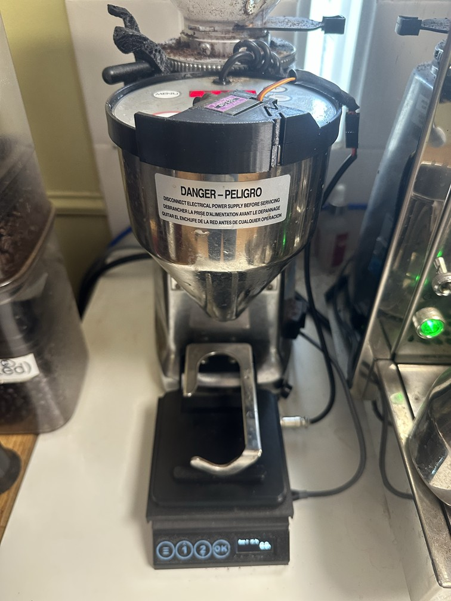
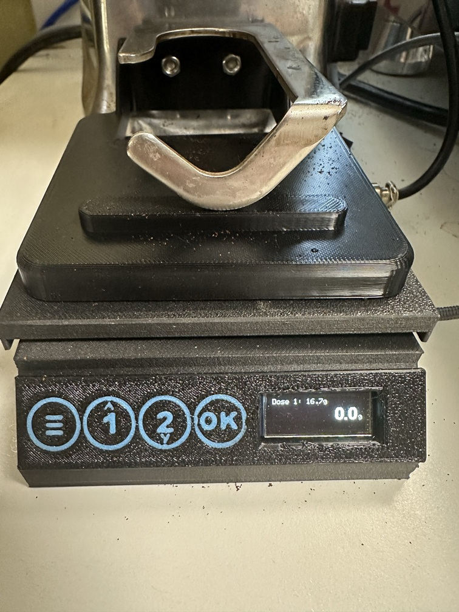

# GrinderBot

A scale that sits under a Mazzer Mini Electronic (Type A) and grinds by weight. A servo clipped onto the grinder's keypad presses and holds the manual button, and lets go when the cup reaches the dose. It learns how much still lands after letting go, so each dose lands close to its target after a few grinds.

  
  

Arduino MKR WiFi 1010, HX711 and a 1 kg load cell, 128×32 OLED, four touch pads, a buzzer and an MG90S servo. PlatformIO project. Optional logging to Home Assistant over MQTT. Print files are on [MakerWorld](https://makerworld.com/en/models/3416236-grinderbot).

## Using it

| Pad | On the weight screen | In menus |
|---|---|---|
| **OK** | Grind the selected dose (cup on first; it tares itself) | Select / save |
| **1 ▲** | Tap: select dose 1. Hold 2 s: edit it | Up / more |
| **2 ▼** | Tap: select dose 2. Hold 2 s: edit it | Down / less |
| **≡** | Tap: tare. Hold 2 s: menu | Back / cancel |

- **Touching any pad stops a grind.**
- **Beeps:** two when a grind is done, three for a safety stop.
- **Screen:** the top line shows the dose, then progress, then the result, e.g. `Done 16.8 (+0.1)  14.3s`. The weight is in large digits below.
- An OK touch that overlaps a touch on another pad is ignored, so a finger on 2 ▼ that the OK sensor also picks up can't start a grind.

**Menu** (hold ≡):
- **Calibrate:** empty the scale, OK, put on a known weight (100–1000 g; a container of water weighed on a kitchen scale works), OK, check the reading, OK to save.
- **Servo pos:** set the rest position (arm clear of the button) and the press position (button held down). The grinder runs while the press position is held, so unplug it or keep a cup under it.
- **Dose 1 / Dose 2:** 1.0–99.9 g.
- **Offset 1 / Offset 2:** how far short of the target the button is let go, for the grounds still falling and the motor spinning down. Each dose learns its own (often different beans) and settles within a few grinds. Set by hand here if you like.
- **Max time:** the longest the button is ever held, in seconds.
- **Network:** Wi-Fi and MQTT status, and the grind count.

### Safety stops

The servo lets go of the button if:
- the weight hasn't risen 0.3 g in 5 s (empty hopper, clog)
- the weight drops 5 g below its peak (cup lifted)
- the load cell stops sending readings for 1 s
- the max time is reached

A watchdog also resets the board if the firmware hangs mid-grind, and the servo parks first thing on boot.

## Bill of materials

### Electronics

| Part | Qty | Notes |
|---|---|---|
| Arduino MKR WiFi 1010 | 1 | 3.3 V logic, powered over micro-USB |
| Straight-bar load cell, 75 mm, 1 kg | 1 | M4 holes. An 80 mm bar works too: change the `LoadCell…` parameters in the case model and reprint |
| HX711 load-cell amplifier, 34 mm wide | 1 | Slides into slots on the back wall |
| 0.91" OLED, 128×32, SSD1306, I²C | 1 | Address 0x3C |
| TTP223 capacitive touch module | 4 | 11 mm wide. Power from 3.3 V |
| Passive piezo buzzer | 1 | Must be passive (it's driven at 3 kHz) |
| MG90S metal-gear micro servo | 1 | Powered from the MKR's 5V pin |
| GX12 aviation connector, 3-pin or more | 1 pair | Servo cable from the scale to the grinder |
| Electrolytic capacitor, ~470 µF | 1 | Optional, across the servo supply |
| Micro-USB cable and 5 V USB supply | 1 | |
| Hook-up wire | | |

### 3D-printed parts

Print files: [GrinderBot on MakerWorld](https://makerworld.com/en/models/3416236-grinderbot)

| Part | Material | Notes |
|---|---|---|
| Scale case | PETG | 100 × 125 × 31 mm. Standoffs for the Arduino, HX711 slots, USB and GX12 holes, overload stop |
| Lid (weighing platform) | PETG | 106 × 106 × 13 mm. PETG-CF is stiffer if you have it |
| Touch panel | PETG, two colours | Snaps into the front of the case. Black with light-blue lettering inlays (AMS). Keep the face 1 mm thick: the pads sense through it |
| Servo mount | PETG | Clips around the grinder's keypad head and holds the servo over the manual button |
| Portafilter fork stand | PETG | Sits on the lid; the Mazzer's original portafilter fork bolts to it. The spout hangs down through the slot behind the scale |
| Servo arm cap | TPU | Optional sleeve over the horn arm so it doesn't wear the keypad |
| Feet | TPU | 4, glued into the recesses under the case. Or use ½" (12.7 mm) stick-on bumpers |

### Hardware

| Part | Qty | Notes |
|---|---|---|
| M4 × 20 mm screws and M4 washers (9.7 mm OD) | 4 each | Load cell, two at each end. Washers sit in the counterbores |
| M3 × 12 mm grub screw and M3 nyloc nut | 1 each | Overload stop (see below) |
| M2.5 × 6 mm self-tapping screws | 4 | Arduino to its standoffs |
| Screws from the servo bag | 2 | Servo into the mount |
| Screws from the Mazzer fork bracket | 2 | Bracket onto the fork stand, with nuts |

## Wiring

| Pin | |
|---|---|
| D0–D3 | Touch pads ≡, 1 ▲, 2 ▼, OK (TTP223 powered from 3.3 V) |
| D4 | Servo signal (servo power from 5V and GND) |
| D5 | Buzzer |
| D6 / D7 | HX711 DOUT / SCK |
| D11 / D12 | OLED SDA / SCL |

## Setup

1. **Build and upload** with PlatformIO (VS Code). The libraries install themselves.
2. **Your settings:** the defaults (calibration factor, servo positions, doses, max time) are in `include/config.h`. To use your own without editing it, copy `include/config_local.example.h` to `include/config_local.h` (git-ignored) and uncomment what you need.
3. **Calibrate** from the menu. The factor is printed over serial when it saves; put it in `config_local.h`.
4. **Set the servo positions** from the menu with the grinder unplugged, and put those in `config_local.h` too.
5. **Overload stop:** slide the nyloc nut into the boss before fitting the load cell, and thread the grub screw in from underneath. With about 1 kg on the lid, turn it up until the reading starts to drop, then back it off a quarter turn.

Uploading new firmware wipes the saved settings (they live in program flash), so steps 2–4 are what keep your values across uploads.

## Home Assistant (optional)

1. Copy `include/secrets.example.h` to `include/secrets.h` (git-ignored) and fill in your 2.4 GHz Wi-Fi and the MQTT broker's IP address. The Wi-Fi module can't resolve `.local` names.
2. Upload. A **GrinderBot** device appears through MQTT discovery, with sensors for the last dose, target, grind time, offset, result and a grind count. Every grind is published to `grinderbot/<id>/grind`, and grinds that reached the target also go to `grinderbot/<id>/dose`, so stopped grinds don't skew the statistics.

Without `secrets.h` no network code is built. Network calls only happen while the scale is idle. If Wi-Fi connects but MQTT won't, update the Wi-Fi module firmware with the Arduino IDE's updater.

## Tests

`test/host/run.sh` runs the pad, menu, settings and grind logic on a PC against a simulated scale and grinder. `ci/build.yml` is a GitHub Actions workflow that runs those tests and builds the firmware; move it to `.github/workflows/` to turn it on.
